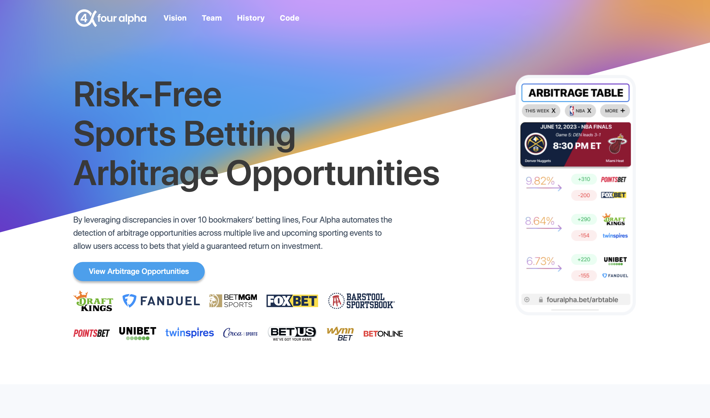
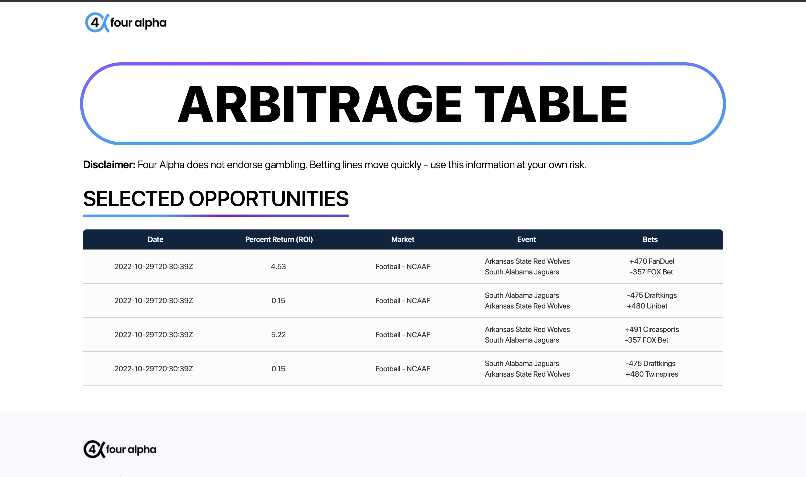

# Four Alpha | https://www.fouralpha.bet

## Background

Recently, the global betting market has experienced exponential growth, fueled by rapid expansion of legalization across multiple states and growing popularity of moibile betting platforms. With the increased number of bookmakers offering pregame and live odds on a variety of sports markets (NBA, NHL, MLB, NFL, MLS, EPL, La Liga, Ligue 1, and more), in many ways, sports betting has become like a financial market, with bookmakers valuing assets by pricing betting odds for outcomes of various events, and the public 'buying' these assets by wagering money on an outcome. Thus, like any financial market, the concept of arbitrage can be leveraged to generate a guaranteed return on investment (ROI).

Arbitrage in sports betting involves placing a bet on all possible outcomes of an event in order to guarantee a profit. In a wager of any kind, the odds placed on an event refect the payout of that event, often implying a probability associated with it. For example, if I flip a coin and win $5 if it's heads or lose $5 if it's tails, then since the payouts are equal, I'm implying that the probability of a heads or tails occuring is 50%. In a fair game, the implied probabilities of the payouts of all possibilities in an event should add up to 1.

Normally, the odds provided by a single sportsbook on a given event are intentionally placed such that the implied probabilities of the event add up to greater than 1 and the bookmaker benefits regardless of who wins. For example, if the Celtics are playing the Lakers, then bookmaker A might offer Celtics Moneyline at -300 and Lakers Moneyline at +200. Each odd represents a payout, which is really just a measure of how likely either side will win. -300 implies 75% and +200 implies 33.33%. The implied probabilities add up to 108.3%. This doesn't make sense because the probaility that the Celtics or the Lakers win is 100%. That extra 8% is the cut bookmakers take known as 'juice'. The house always has an advantage. 

However, odds across different sportsbook vary because differnt sportsbooks have different opinions on the probability of an event. These lines are even more volatile with live betting lines. Differing opinions and volatile lines present an opportunity to find an event whose implied probabilities of all possibilities add up to a number less than 1. This would actually end up guaranteeing a profit for us, regardless of who wins. For example, if bookmaker A offers Celtics Moneyline at -330 and bookmaker B offers Lakers Moneyline at +450, then betting the right amount on both would guarantee a return. Mathematically, their implied probabilities add up to 93%, which means there is about a 7% profit for us.

We are currently working on a suite of propriery products that use data analysis in order to exploit market inefficiencies and produce other types of profitable wagering opportunities.

## Application

In its initial iteration, Four Alpha uses a Python engine that leverages theOddsAPI to gather odds from 15+ international bookmakers on 60+ sports betting markets. The engine parses the response and algorithmically detects arbitrage opportunities for a given event. We run the engine on both historical odds to generate a record of past arbitrage opportunities as well as live odds to detect current available arbitrage opportunities.

When arbitrage is detected, a record of it is created and stored in Firebase. Our React front end connects to the Cloud Firestore and grabs all of the arbitrage records to put on display. The front end is deployed and hosted on Vercel.  

## Pictures

  
  

  Home Page and Arb Table

## Technlogies
- 
- 
- 
- 
- 
- 

---
*© 2023 Four Alpha*
